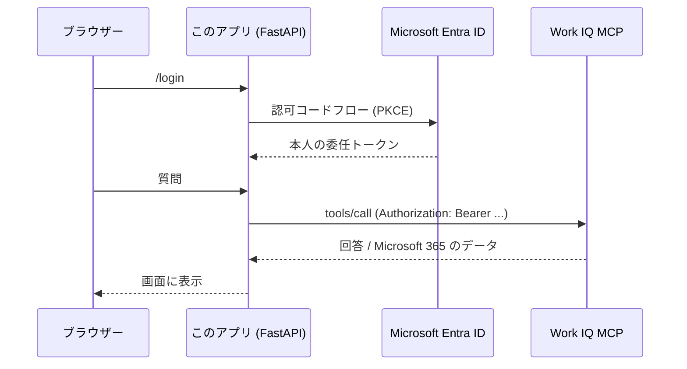

# Work IQ MCP × Microsoft Agent Framework (Python / Web アプリ)

Work IQ の MCP サーバーを Web アプリから呼ぶ最小サンプルです。
サインインした人の権限で Microsoft 365 を参照し、**Ask** と **Tool** という
2 つの使い方を画面で切り替えて比べられます。

Microsoft Agent Framework (MAF) で書いていますが、Work IQ 側は素の MCP サーバーです。
LangGraph でも Semantic Kernel でも、MCP クライアントを持つフレームワークなら同じように繋がります。

## 2 つの使い方

| | **Ask** | **Tool** |
|---|---|---|
| 回答を書くのは | Work IQ (Microsoft 365 Copilot) | 自分のモデル |
| 使う MCP ツール | `ask` | `fetch` / `search_paths` / `get_schema` / `call_function` |
| 自前モデルの呼び出し | なし | あり (function calling のループ) |
| 得意なこと | Microsoft 365 全体の横断検索をそのまま使う | 自社データや自社ロジックと同じ会話に混ぜる |
| 引き換えに | 回答の作り方に手を入れられない | 探索の設計と打ち切り制御が自分の責任 |
| 実装 | [workiq.py](workiq.py) の `ask()` | [workiq.py](workiq.py) の `run_agent()` |

両方を同じエージェントに持たせることもできます。
「まず `ask` に投げて、足りなければ `fetch` で自分で掘る」という設計が実用的です。

## 構成

| ファイル | 内容 |
|---|---|
| [main.py](main.py) | FastAPI。サインインと画面 |
| [workiq.py](workiq.py) | Work IQ MCP の呼び出し。Ask と Tool の 2 実装 |
| [templates/index.html](templates/index.html) | 1 ページ |
| [run.cmd](run.cmd) | Windows 用の起動用。ダブルクリックで環境構築から起動まで |

ブラウザー → このアプリ → Work IQ、の 1 段だけです。
SPA も別の API も立てないので、**On-Behalf-Of によるトークン交換が要りません**。
アプリ登録も 1 つで済みます。



## 前提

- Python 3.10 以上
- Tool 方式のみ: **Azure OpenAI / Microsoft Foundry** のモデルデプロイと、
  自分のアカウントへの `Cognitive Services OpenAI User` ロール

### テナント側の準備（テナントにつき 1 回、グローバル管理者）

アプリ登録の**前に**、テナントを Work IQ 対応にしておく必要があります。
詳細は [Work IQ のテナントを有効にする](https://learn.microsoft.com/microsoft-365/copilot/extensibility/work-iq/enable-work-iq) を参照してください。

1. **従量課金プラン**を Copilot Studio で構成し、利用するユーザーを割り当てる
2. **Work IQ のサービスプリンシパルをテナントに作成**する

```bash
az ad sp create --id fdcc1f02-fc51-4226-8753-f668596af7f7
```

> これを実行しないと、アプリ登録の「組織で使用している API」で **Work IQ が検索にヒットしません**。
> 既に存在する場合は conflict エラーになりますが、害はありません。
> 確認だけなら `az ad sp show --id fdcc1f02-fc51-4226-8753-f668596af7f7`。

### ライセンスと課金

**Microsoft 365 Copilot ライセンスは不要です。**
Work IQ API は [ライセンスとは独立した従量課金](https://learn.microsoft.com/microsoft-365/copilot/extensibility/work-iq/#access-and-pricing)（Copilot Credits）で提供されます。

必要なのは、従量課金プランと**そのプランへのユーザー割り当て**だけです。
逆に、**ライセンスを持っていてもこのサンプルのような自前アプリから呼べば課金対象**になります
（ライセンスで無料になるのは Copilot 製品内の体験のみ）。

## セットアップ

### 1. アプリ登録

Microsoft Entra 管理センター > **Entra ID** > **アプリの登録** > **新規登録**。
サポートされるアカウントの種類は **この組織ディレクトリのみ**。
発行された **アプリケーション (クライアント) ID** を控えます。

**認証** > **プラットフォームを追加** > **Web** を選び、リダイレクト URI に次を登録します。

```text
http://localhost:8000/auth/callback
```

**証明書とシークレット** > **新しいクライアント シークレット**。
発行された **値** をその場で控えます (後から表示できません)。

**API のアクセス許可** > **＋ アクセス許可の追加** > **所属する組織で使用している API** タブ。
検索ボックスに `work` と入力します。

> ⚠️ 複数ヒットします。**名前ではなくアプリケーション ID で選んでください。**
>
> | 名前 | アプリケーション ID | |
> |---|---|---|
> | **Work IQ** | **`fdcc1f02-fc51-4226-8753-f668596af7f7`** | ✅ これ |
> | Work IQ Calendar MCP Connector | `02f0a7dc-...` | ❌ Agent 365 の Calendar 専用サーバー |

**委任されたアクセス許可** > **`WorkIQAgent.Ask`** にチェック > **アクセス許可の追加**。

> ⚠️ よく似た **`WorkIQAgent.Ask.Selected`** も並びます。`.Selected` が付いていないほうです。

一覧に戻ったら **「〇〇 に管理者の同意を与えます」** > **はい**。
`WorkIQAgent.Ask` の「状態」列が緑のチェックになれば完了です。

> 管理者の同意にはグローバル管理者ロールが必要です。日常利用には不要なので、
> Microsoft Entra PIM で一時的に昇格して付与し、終わったら解除してください。

### 2. 起動 (Windows)

**[run.cmd](run.cmd) をダブルクリック**します。仮想環境の作成、依存の導入、
`.env` の用意、起動、ブラウザーを開くところまでをまとめて行います。

1 回目は `.env` が未設定なのでメモ帳が開きます。控えた値を入れて保存し、
もう一度ダブルクリックしてください。`SESSION_SECRET` は次で生成します。

```bash
python -c "import secrets; print(secrets.token_hex(32))"
```

Tool 方式を使う場合は、別途 `az login` を済ませておいてください。

### 3. 起動 (手動 / macOS・Linux)

```bash
python -m venv .venv
.venv\Scripts\activate          # macOS / Linux は source .venv/bin/activate
pip install -r requirements.txt

copy .env.example .env          # macOS / Linux は cp
# .env を編集する

az login                        # Tool 方式のモデル呼び出しに使う
uvicorn main:app --reload
```

<http://localhost:8000> を開き、サインインして質問します。

## コードの読みどころ

### 委任認証 — 見える範囲は本人の権限そのまま

アプリの資格情報ではなく、**サインインした本人のトークン**で Work IQ を呼びます。
そのため参照できる範囲は、その人が Microsoft 365 で見られる範囲と一致します。
アプリ側で権限チェックを書く必要はありません。
別のアカウントでサインインし直して同じ質問をすると、違いがそのまま出ます。

トークンは `header_provider` でリクエストごとに供給しています。
MSAL 側がキャッシュと更新を持つので、画面を開いたままでも期限切れになりません。

```python
MCPStreamableHTTPTool(
    name="workiq",
    url="https://workiq.svc.cloud.microsoft/mcp",
    header_provider=lambda _: {"Authorization": f"Bearer {get_token()}"},
    allowed_tools=["ask"],
)
```

エンドポイントとスコープはハードコードではなく、Work IQ 自身が公開しています。

```bash
curl https://workiq.svc.cloud.microsoft/.well-known/oauth-protected-resource/mcp
```

### `allowed_tools` — 読み取り専用はプロンプトではなくコードで縛る

Work IQ MCP には書き込み系のツール (`create_entity` / `update_entity` /
`delete_entity` / `do_action`) もあります。
テナントのポリシーで既定では止まりますが、**モデルにそもそも渡さない**のが確実です。
`allowed_tools` はプロンプトでのお願いではなく実際の制限なので、監査にも説明しやすくなります。

### ツールは 10 個、増えない

Work IQ MCP は「ツール = 動詞、Microsoft Graph の相対パス = 目的語」という設計です。
対応ワークロードが増えても**パスが増えるだけでツールは増えません**。

```text
fetch          /me/messages        → メールを読む
call_function  /me/calendarView    → 予定を期間指定で取る
search_paths   "messages"          → 使えるパスを探す
ask            "今週の決定事項は?"  → Copilot に聞く
```

既定で許可されるパスは `/me/`、`/users/`、`/sites/` 配下です。

### `structuredContent` の扱いに注意

Work IQ は結果の一部を MCP のテキストではなく `structuredContent` で返します。
`fetch_blob` / `call_function` / `search_paths` / `create_entity` は結果本体がこちらです。
`ask` も、回答文は両方に入りますが **`conversationId` は `structuredContent` にしかありません**。

MAF はこれを **末尾に追加する別のテキストブロック**として扱います。
つまり `call_tool("ask")` の戻り値は 2 ブロックになり、
全部を連結して `json.loads` すると必ず失敗します。
[workiq.py](workiq.py) の `_parse_ask()` はブロックごとに JSON を試しています。

```python
# 実際の戻り値
TextContent(text="pong")                                        # content
TextContent(text='{"answer":"pong","conversationId":"..."}')    # structuredContent
```

モデルに渡る分にはこの変換が効くので Tool 方式では問題になりませんが、
**OpenAI Responses API のネイティブ MCP (`type: "mcp"`) に直接繋ぐ経路では
`structuredContent` がモデルに渡らず「結果なし」になります**。

### ドキュメントと実物がずれる

上の `ask` の応答キーは、Learn のツールリファレンスでは `response` と書かれていますが、
**実サーバーが返すのは `answer`** でした（2026-09-15 実測）。
`tools/list` が返す description には正しく `answer` と書かれています。

**迁移先や引数を推測せず、`tools/list` の `inputSchema` と description を実行時に読む**のが確実です。
テナントのポリシーで公開されるツールも変わります。

## このサンプルが省いていること

サンプルを読みやすくするために割り切っている点です。本番ではここを埋めてください。

| 項目 | 現状 | 本番では |
|---|---|---|
| トークンの置き場 | プロセス内の dict。再起動で消え、複数インスタンスで共有されない | Redis などの外部セッションストア |
| クライアント シークレット | `.env` | Key Vault、またはフェデレーション資格情報 (シークレットレス) |
| 回答の表示 | Markdown をそのまま表示 | Markdown をサニタイズしてレンダリング |
| 進捗表示 | 実行中の文言のみ | ストリーミング |
| 打ち切り制御 | なし | Tool 方式の往復回数と実行時間に上限を設ける |
| 監査ログ | なし | 誰がどのツールを何の引数で呼んだかを記録 |

認可コードフローは PKCE (S256) と state で保護されています。
リダイレクト URI が `https://` のときは、認可コードを URL ではなく POST 本文で受け取る
`form_post` に自動で切り替わります ([RFC 9700 4.3.1](https://www.rfc-editor.org/rfc/rfc9700.html#section-4.3.1))。
localhost の HTTP では cookie の `SameSite=None` が使えないため `query` のままです。

## 他のフレームワークに移すとき

変わるのは MCP クライアントの作り方だけで、URL・スコープ・ツール名・引数はすべて同じです。

| | |
|---|---|
| MAF (本サンプル) | `MCPStreamableHTTPTool(url=..., header_provider=...)` |
| LangChain / LangGraph | `langchain[mcp]` の `MCPAdapter` に Bearer トークン付きクライアントを渡す |
| 素の MCP SDK | `mcp.client.streamable_http` に `Authorization` ヘッダーを付ける |

## 参考

- [Work IQ MCP overview](https://learn.microsoft.com/microsoft-365/copilot/extensibility/work-iq/mcp/overview)
- [Work IQ MCP tool reference](https://learn.microsoft.com/microsoft-365/copilot/extensibility/work-iq/mcp/tool-reference) — 10 個のツールの引数と応答
- [Policy governance for Work IQ MCP](https://learn.microsoft.com/microsoft-365/copilot/extensibility/work-iq/mcp/policy-governance-mcp) — 書き込み操作の既定ブロックと解除
- [Microsoft Agent Framework](https://learn.microsoft.com/agent-framework/)
